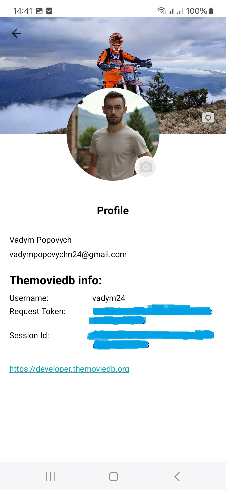

# Template app
Template - it basic configuration for Android app

## Overview
The Template app is a basic configuration starting point for Android application development. The Template repository contains the fundamental structure and configuration files needed to bootstrap an Android project quickly, eliminating the need to set up common boilerplate code and configurations manually.

## Purpose and Scope
The Template repository is designed to provide developers with a standardized, minimal starting point for Android application development. It includes basic configuration files and follows Android development best practices. This overview covers the high-level components and structure of the template, but does not delve into implementation details.

### The Template app stack:
- Android SDK
- XML layouts, Fragment, Activity, Compose
- Navigation component
- ViewModel
- Dagger
- Coroutines, Flow, LiveData, Rx
- SQLite3, Room, Datastore
- Clean Architecture, MVVM
- Paging3
- Retrofit2
- Firebasew - Cloud Messaging, Remote Config, App distribution

### The Template app showcases:
- Login, Registration, SignOut and Forgot Password process
- Profile, Edit Profile data, Change password, Settings
- Left and bottom menu navigation
- Back button handling
- Example with compose list
- Pagination list
- Integration with Architecture Components: Navigation, Fragments, ViewModel
- Integration with Themoviedb service as API source
- Validation module
- JUnit4 tests

## Screenshots
  <table width="100%">
    <tr>
      <td align="center" width="25%">
        
      </td>
      <td align="center" width="25%">
        
      </td>
      <td align="center" width="25%">
        
      </td>
      <td align="center" width="25%">
          
      </td>
    </tr>
    <tr>
      <td align="center" width="25%">
        
      </td>
      <td align="center" width="25%">
        
      </td>
      <td align="center" width="25%">
        
      </td>
      <td align="center" width="25%">
        
      </td>
    </tr>
    <tr>
      <td align="center" width="25%">
        
      </td>
      <td align="center" width="25%">
        
      </td>
      <td align="center" width="25%">
        
      </td>
      <td align="center" width="25%">
        
      </td>
    </tr>
    <tr>
      <td align="center" width="25%">
        
      </td>
      <td align="center" width="25%">
        
      </td>
      <td align="center" width="25%">
        
      </td>
      <td align="center" width="25%">
        
      </td>
    </tr>
  </table>

## When to Use Template
This template is ideal for:
- Starting new Android application projects
- Learning Android development fundamentals
- Creating examples or prototypes
- Standardizing project setups within a team or organization

The template provides the minimal necessary configuration to start development, allowing developers to focus on implementing application-specific features rather than setting up the project structure.

## Benefits of Using the Template
Using this template offers several advantages for Android development:
- Consistent Project Structure: 
- Follows Android best practices for organization
- Time Savings: Eliminates repetitive setup of standard configurations
- Standardization: Provides a common foundation for multiple projects
- Reduced Setup Errors: Avoids common configuration mistakes
- Faster Development Start: Enables developers to begin coding features immediately

The Template serves as a foundation that can be extended and customized according to specific project requirements, while maintaining alignment with Android development standards.

## What you need to know before you start

- The Template application uses [The Movie Database] (https://developer.themoviedb.org/docs/getting-started) (TMDB) as the API server example.
- The application implements registration and login using the TMDB service and a local database as a server substitute. Note: In a real project, do not store passwords in a local database and do not replace server-side logic (such as user creation) with local actions  — this is done here only as an example for the login feature. The mobile side only needs to send API requests to the server.
- Check all TODOs in the code before proceeding.
- Use the remote package for API requests. Some methods in this package only simulate API responses — be sure to replace them with your actual implementation in a real project.
- You can handle API errors in the web service layer. See the signUp() method in the LoginWebserviceImpl class for an example. Uncomment the provided code and handle errors according to your needs.
- Remove the hardcoded token value and retrieve it from preferences in a real project. The current implementation is only for TheMovieDB testing purposes.
- Look for the code .delay(2, TimeUnit.SECONDS) in the project. It is used only to simulate the API request execution and the appearance of the progress bar and should be removed in the real project.
- If you need to get the current user from the database, you can do it by using their email or by creating another ID stored in preferences.
- Don’t use ObservableField, use LiveData, StateFlow, or other binding-friendly types instead.
- Avoid using ObservableField because it's heavy and can cause lifecycle issues. It's better to use data binding to set values directly into the View.
- Use the following naming convention in layouts: view_name_name_of_item for example: tv_fisrt_name, btn_login, et_email, etc. For more on naming conventions, see the [Resource Organization](https://github.com/Vadym-Popovych24/Template/wiki/Resource-Organization).
- Centralize Data Storage on Login. When logging into the application, users may reach the main NavigationActivity through different entry points (e.g., login, registration, or password reset). To ensure consistency, all identifiers and tokens should be stored using a centralized approach. Use the <b>saveAuthData()</b> method to handle this. Uncomment, modify, and use it according to your requirements.
- Logout Handling. Uncomment <b>database.clearAllTables()</b>to properly handle user logout. It is currently commented out for user retention and testing purposes during the login process. In real projects, the database should be cleared on logout to ensure data consistency and security.
- The project supports product flavors defined in app/build.gradle under the <b>productFlavors {} </b> section. Available Flavors:
  - dev – Development configuration;
  - prod – Production configuration.

These flavors allow you to customize settings such as: API endpoints, keys, app name and icon, other environment-specific values. ⚠️ Currently, both flavors use the same values (for demonstration purposes only). You can customize them as needed.
- If needed, you can use BaseManager, BaseRepository, BaseViewmodel, BaseFragment, BaseActivity, BaseDao or other base class to share common functionality.
- fun provideHttpClientWithToken(preferences: PreferencesHelper) – configures an HTTP client that automatically adds the token from preferences to all API requests.
- If your app uses an access token that can expire, you can handle token refresh by using a TokenAuthenticator. To support this, implement the function: fun refreshToken(refreshToken: String). This function should request a new access token using the provided refresh token.
- Avoid accessing preferences from the UI thread. Always use a background thread or coroutine to prevent UI blocking and ensure smooth performance.
- Handling Database Schema Changes. When modifying the database structure — such as renaming or deleting a column or table, in the TemplateDatabase class you can use the MyMigration class with Room's built-in AutoMigration annotations: @DeleteTable, @RenameTable, @DeleteColumn, @RenameColumn. These annotations allow you to define migrations declaratively and safely apply schema changes during version upgrades.
- The application uses code shrinking and resource optimization for the release build type <b>(minifyEnabled = true, shrinkResources = true)</b>.
To add custom ProGuard/R8 rules, use the proguard-rules.pro file. After building the release, the following files will be available under app/build/outputs/mapping/release/:
  - mapping.txt – Mapping of original class/method/field names to obfuscated ones (used for deobfuscation). ⚠️ Important: Always archive the mapping.txt file alongside your release artifacts (especially when publishing to the Play Store). Without it, stack traces from obfuscated crash reports cannot be deobfuscated.
  - seeds.txt – List of classes and members that were kept (not obfuscated).
  - usage.txt – Shows code elements that were removed during shrinking.
  - resources.txt – Complete list of app resources (XML, drawables, strings, layouts, etc.) that were included in the final .apk or .aab.
  - configuration.txt – A merged summary of all ProGuard/R8 rules applied during the build (from default rules, libraries, and your custom ones).
- The app is partially covered by JUnit tests across various areas, including: Model data classes, Web services, Repositories, Managers, ViewModels, Utility classes. You can use and extend these test classes to write your own tests and improve coverage.
- 🔔 Testing Push Notifications. To test push notifications, follow these steps:
Go to Firebase Console → Left menu → Messaging → New Campaign → Notifications.
Fill in the required information:
  - Title and Text (you can enter any content).
  - Target app: select either the production or development variant.
  - In the Scheduling step, select Now.
  - In the Additional options step (for navigating to movie details), add the following key-value pairs:
  - EXTRA_TOPIC → MOVIE_DETAILS
  - EXTRA_ID → your_movie_id (e.g., 539772, 811941)

After filling in all the data, return to the Notification step.
Click Send test message.
Enter your FCM token and click Test.
You should receive the notification shortly on your device.

- ⚙️ Remote Config Support. The Template app supports Firebase Remote Config. An example implementation is provided for dynamically changing the bottom navigation menu order. In the Firebase Remote Config console, there is a parameter named:
menu_variant → accepts values from 1 to 4
This value determines the position of the "Popular" item in the bottom navigation menu.
The logic is implemented in NavigationActivity, property menuVariant get a value from remote config, method setMenuOrder() set a menu variant for bottom menu and takes effect on every onResume() call. 🔁 Note: In a real production environment, you should change minimumFetchIntervalInSeconds from 0 (used for testing) to 3600 (1 hour) or more to avoid unnecessary frequent fetches and potential quota issues.

For more information, refer to the project Wiki:
- [Overview](https://github.com/Vadym-Popovych24/Template/wiki/Overview)
- [Getting Started](https://github.com/Vadym-Popovych24/Template/wiki/Getting-Started)
- [Architecture](https://github.com/Vadym-Popovych24/Template/wiki/Architecture)
- [Component Structure](https://github.com/Vadym-Popovych24/Template/wiki/Component-Structure)
- [Resource Organization](https://github.com/Vadym-Popovych24/Template/wiki/Resource-Organization)
- [Build Process](https://github.com/Vadym-Popovych24/Template/wiki/Build-Process)
- [Activity Lifecycle](https://github.com/Vadym-Popovych24/Template/wiki/Activity-Lifecycle)
