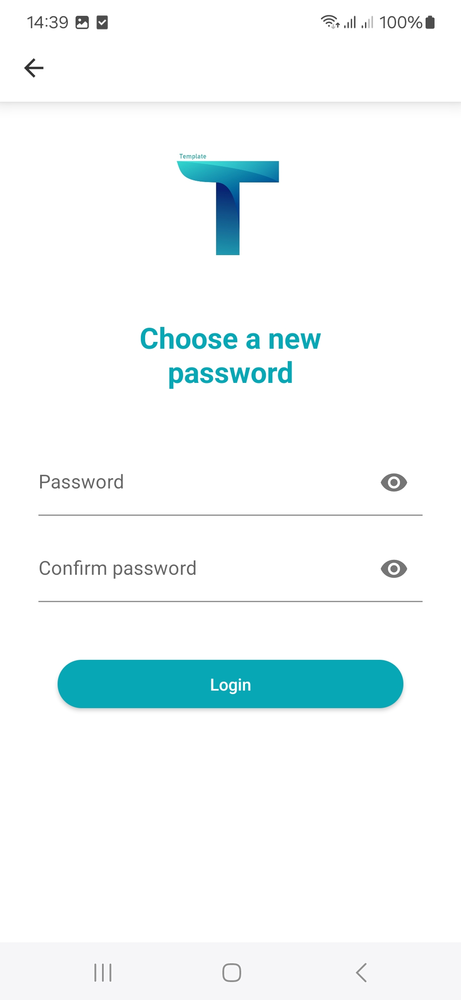

# Template app
Template - it basic configuration for Android app

## Overview
The Template app is a basic configuration starting point for Android application development. The Template repository contains the fundamental structure and configuration files needed to bootstrap an Android project quickly, eliminating the need to set up common boilerplate code and configurations manually.

## Purpose and Scope
The Template repository is designed to provide developers with a standardized, minimal starting point for Android application development. It includes basic configuration files and follows Android development best practices. This overview covers the high-level components and structure of the template, but does not delve into implementation details.

### The Template app stack:
- Android SDK
- XML layouts, Fragment, Activity, Compose
- Navigation component
- ViewModel
- Dagger
- Coroutines, Flow, LiveData, Rx
- SQLite3, Room, Datastore
- Clean Architecture, MVVM
- Paging3
- Retrofit2
- Firebasew - Cloud Messaging, Remote Config, App distribution

### The Template app showcases:
- Login, Registration, SignOut and Forgot Password process
- Profile, Edit Profile data, Change password, Settings
- Left and bottom menu navigation
- Back button handling
- Example with compose list
- Pagination list
- Integration with Architecture Components: Navigation, Fragments, ViewModel
- Integration with Themoviedb service as API source
- Validation module
- JUnit4 tests

## Screenshots
  <table width="100%">
    <tr>
      <td align="center" width="25%">
        
      </td>
      <td align="center" width="25%">
        
      </td>
      <td align="center" width="25%">
        
      </td>
      <td align="center" width="25%">
          
      </td>
    </tr>
    <tr>
      <td align="center" width="25%">
        
      </td>
      <td align="center" width="25%">
        
      </td>
      <td align="center" width="25%">
        
      </td>
      <td align="center" width="25%">
        
      </td>
    </tr>
    <tr>
      <td align="center" width="25%">
        
      </td>
      <td align="center" width="25%">
        
      </td>
      <td align="center" width="25%">
        
      </td>
      <td align="center" width="25%">
        
      </td>
    </tr>
    <tr>
      <td align="center" width="25%">
        
      </td>
      <td align="center" width="25%">
        
      </td>
      <td align="center" width="25%">
        
      </td>
      <td align="center" width="25%">
        
      </td>
    </tr>
  </table>

## What you need to know

## When to Use Template
This template is ideal for:
- Starting new Android application projects
- Learning Android development fundamentals
- Creating examples or prototypes
- Standardizing project setups within a team or organization

The template provides the minimal necessary configuration to start development, allowing developers to focus on implementing application-specific features rather than setting up the project structure.

## Benefits of Using the Template
Using this template offers several advantages for Android development:
- Consistent Project Structure: 
- Follows Android best practices for organization
- Time Savings: Eliminates repetitive setup of standard configurations
- Standardization: Provides a common foundation for multiple projects
- Reduced Setup Errors: Avoids common configuration mistakes
- Faster Development Start: Enables developers to begin coding features immediately

The Template serves as a foundation that can be extended and customized according to specific project requirements, while maintaining alignment with Android development standards.

For more information, refer to the project Wiki:
- [Overview](https://github.com/Vadym-Popovych24/Template/wiki/Overview)
- [Getting Started](https://github.com/Vadym-Popovych24/Template/wiki/Getting-Started)
- [Architecture](https://github.com/Vadym-Popovych24/Template/wiki/Architecture)
- [Component Structure](https://github.com/Vadym-Popovych24/Template/wiki/Component-Structure)
- [Resource Organization](https://github.com/Vadym-Popovych24/Template/wiki/Resource-Organization)
- [Build Process](https://github.com/Vadym-Popovych24/Template/wiki/Build-Process)
- [Activity Lifecycle](https://github.com/Vadym-Popovych24/Template/wiki/Activity-Lifecycle)
